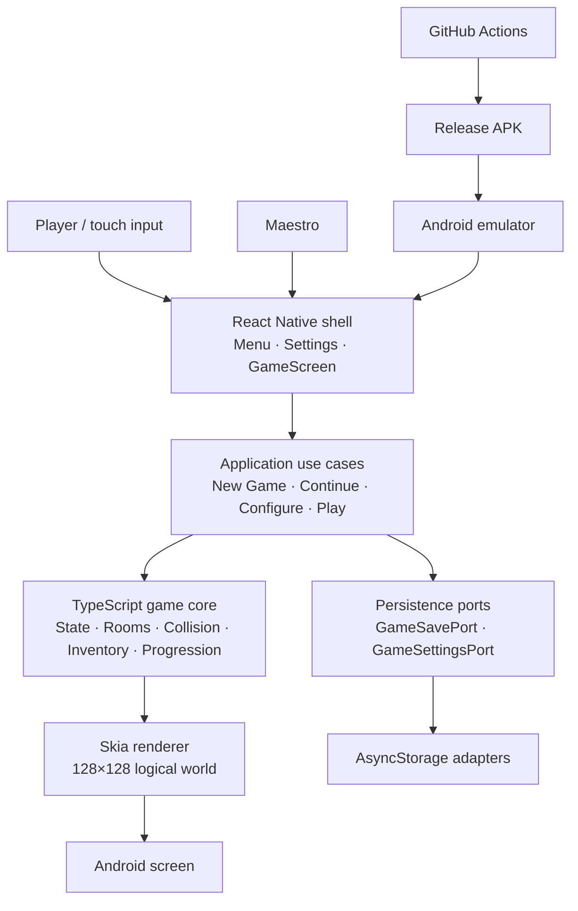

# Pyjamada

**A tiny retro adventure built as a React Native game architecture playground.**

Pyjamada explores a simple idea:

> **React Native owns the app shell. TypeScript owns the game. Skia owns the pixels.**

It is a real Android vertical slice you can clone, build, play, test, and automate.

### Why clone it?

- Framework-independent TypeScript game core.
- React Native without using React as the game loop.
- React Native Skia rendering a 128×128 logical world.
- Versioned save/settings persistence behind ports and adapters.
- Deterministic room, collision, inventory, and progression logic.
- Release APK validation on an Android emulator.
- Maestro-driven gameplay and reproducible screenshots.
- Small enough to understand and modify quickly.

**The game is the demo; the architecture is the experiment.**

[](https://github.com/krukmat/Pyjamada/actions/workflows/android-emulator-smoke.yml)

## Android tour

These screenshots come from the actual release APK. Maestro drives the playable flow automatically:

**Bedroom → key → door → Hall → Landing**

<table>
  <tr>
    <td align="center"></td>
    <td align="center"></td>
    <td align="center"></td>
  </tr>
  <tr>
    <td align="center"><strong>Main menu</strong></td>
    <td align="center"><strong>Explore</strong></td>
    <td align="center"><strong>Find the key</strong></td>
  </tr>
</table>

<table>
  <tr>
    <td align="center"></td>
    <td align="center"></td>
    <td align="center"></td>
  </tr>
  <tr>
    <td align="center"><strong>Open the door</strong></td>
    <td align="center"><strong>Cross the hall</strong></td>
    <td align="center"><strong>Reach the landing</strong></td>
  </tr>
</table>

The full capture set also includes the [settings screen](artifacts/android-screenshots/02_settings.png).

## Clone and run

```bash
git clone https://github.com/krukmat/Pyjamada.git
cd Pyjamada
npm install
npm run android
```

Node.js 22.13+ is required.

## Architecture

At a glance, the implementation separates **app concerns**, **game rules**, **rendering**, and **platform services**:



The important boundary is the middle: **React handles the shell, the TypeScript core owns gameplay decisions, and Skia only renders state.** Persistence and Android tooling sit behind replaceable edges rather than leaking into the game rules.

## Experiment with it

Swap the renderer, replace persistence, add rooms, change controls, or redesign the visuals without rewriting the game core.

## Validate it

```bash
npm run typecheck
npm run test:v1
npm run screenshots:android
```

The screenshot command builds the release APK and reproduces the complete Android tour with Maestro. The CI [Android emulator smoke workflow](.github/workflows/android-emulator-smoke.yml) separately validates native startup and emulator execution.

For the deeper design notes, see [Visual Baseline V1.1](docs/VISUAL_BASELINE_V1_1.md), [V1 Review](docs/V1_REVIEW.md), and the [Maestro capture guide](maestro/README.md).

## Scope

Current baseline: **V1.1 / v0.6.0**.

Pyjamada intentionally stops at a three-room vertical slice. Broader gameplay, final audio/art, monetization, cloud features, and iOS remain outside the current baseline.
