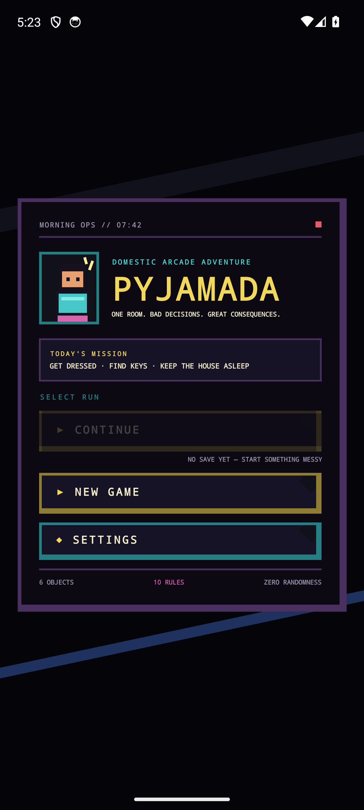
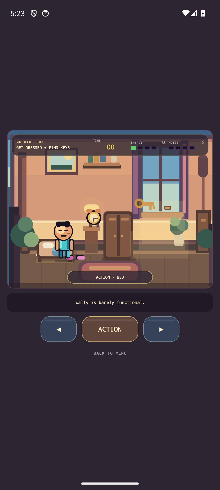
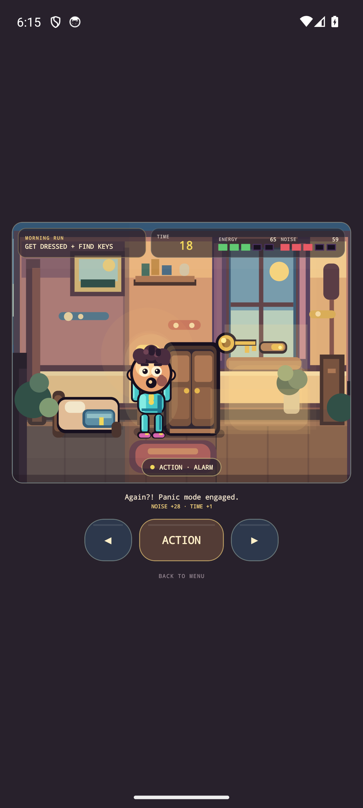
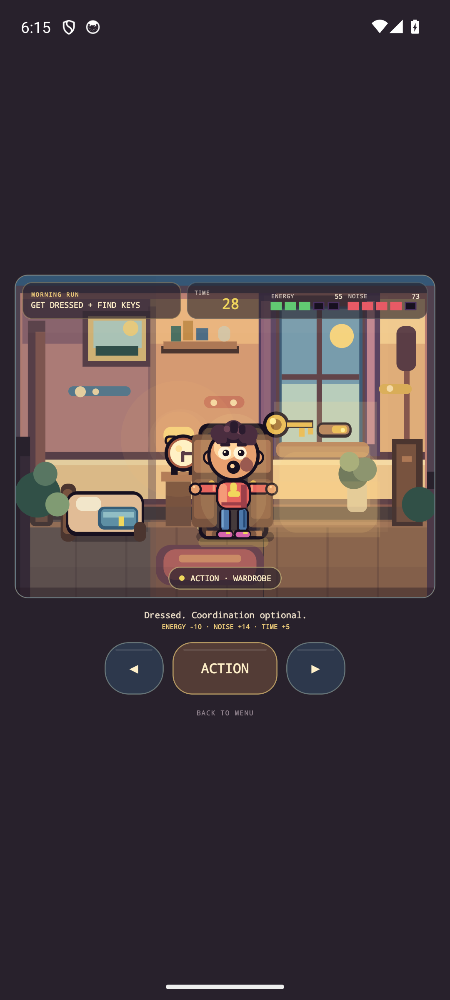
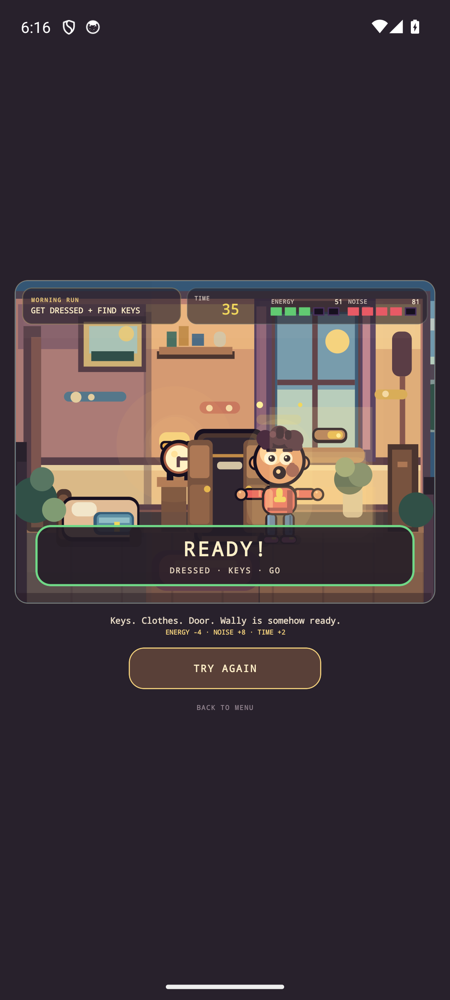
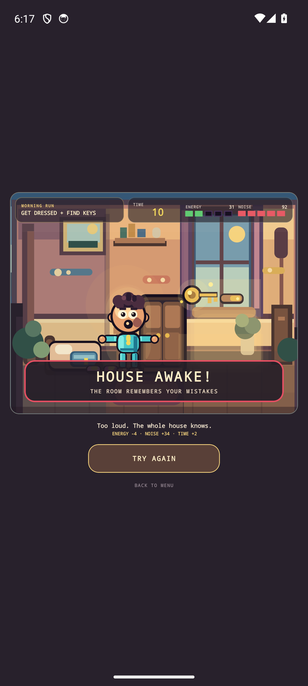

# Pyjamada

**A small domestic arcade adventure that starts with getting dressed and ends underneath a haunted house.**

Pyjamada is an Android-first React Native game built around deterministic TypeScript gameplay, room-by-room exploration and an illustrated Skia presentation.

Wally's morning begins with a simple objective: get dressed, find the keys and leave without waking the house. The successful escape immediately goes wrong, opening a connected haunted-house adventure that leads through increasingly impossible domestic spaces, an underground experiment and a final confrontation with Dr. Vesper and the Resonator.

```text
Bedroom
   ↓
false escape
   ↓
Hallway → Living Room → Kitchen → Bathroom → Attic → Basement → Laboratory
                                                                ↓
                                                        Vesper / Resonator
                                                                ↓
                                                           morning after
```

## What the game is

The opening Bedroom is a compact systemic arcade sandbox:

- six interactive objects: `bed · slippers · alarm clock · wardrobe · keys · window`;
- time, energy and noise pressure;
- deterministic rules and consequences;
- Dream Spark combat and Ghost pressure;
- success/failure/retry loops.

Escaping the Bedroom becomes Act I rather than the end of the game. From there, Adventure mode owns progression across a connected house.

Each room has a concrete gameplay purpose:

- **Hallway** — establishes that normal space/time rules are broken.
- **Living Room** — reveals that the haunting is being observed and driven deliberately.
- **Kitchen** — introduces causal environmental manipulation through the electrical system.
- **Bathroom** — uses reflection geometry to expose an impossible route.
- **Attic** — connects the evidence and identifies Wally as Subject W-01.
- **Basement** — turns investigation into direct interaction with unstable experiment infrastructure.
- **Laboratory** — resolves the conflict through a three-stage Vesper/Resonator encounter.
- **Ending** — returns Wally to the Bedroom, leaves physical evidence behind and closes with one final Ghost sting.

The Laboratory finale is deliberately specific rather than built on a generic boss engine:

```text
BREAK VESPER'S CONTROL
        ↓
DESTABILIZE THE RESONATOR
        ↓
DEFEAT VESPER NIGHTMARE
        ↓
SHUT DOWN RESONATOR
```

## Design principles

Pyjamada keeps a few constraints intentionally strong:

1. **Arcade first, adventure second.** Story and exploration should not turn the game into a slow point-and-click experience.
2. **Domestic object + supernatural distortion = gameplay.** Ordinary spaces and objects become mechanics, hazards or clues.
3. **The house is one connected world.** Rooms are not isolated level-select screens.
4. **State before exposition.** Visual/world changes should communicate progression before text explains it.
5. **Deterministic systems are easier to test, save and review.**
6. **Do not generalize too early.** Room-specific gameplay stays local until a real second reuse case exists.

## Architecture

React Native owns the application shell. TypeScript owns gameplay state and rules. Skia owns the rendered world.

```text
                              PYJAMADA
                                  │
                           React Native shell
                                  │
                  ┌───────────────┼────────────────┐
                  ▼               ▼                ▼
              MainMenu        Settings         Ending
                  │
                  ▼
          HauntedGameScreen
                  │
          ┌───────┴────────┐
          ▼                ▼
   Bedroom/Systemic   Adventure exploration
       runtime             runtime
          │                │
          │          AdventureState
          │          RoomRegistry
          │          room-local effects
          │                │
          └───────┬────────┘
                  ▼
             GameCanvas
                  │
          RoomPresentation
        ┌─────────┼──────────────────────────────┐
        ▼         ▼                              ▼
     Bedroom   domestic rooms                Laboratory
                  │
                  ▼
                 Skia
```

The persistence model separates the original Haunted session from connected-adventure progression:

```text
AdventureGameSessionState · envelope v3
├── HauntedSessionState
└── AdventureState · schema v1
    ├── current room / entry
    ├── visited rooms
    ├── global story flags
    └── room-local inspected/interactions/switches
```

Transient projectiles, presentation events and attempt-level combat state are normalized at the appropriate save/Continue boundaries.

The ending reuses the existing Bedroom and save model rather than creating a separate level or cinematic framework.

## Presentation

The visual direction is modern 80s/90s arcade: strong silhouettes, horizontal stage rhythm, readable hazards, layered depth and exaggerated consequences.

The renderer combines:

- procedural Skia environments;
- illustrated Wally/object presentation;
- semantic animation selection;
- deterministic telegraphs and hazard states;
- room-specific visual language;
- a shared mobile-oriented viewport.

The goal is not to reproduce an existing game's art or layout. The presentation uses original characters, room compositions, UI and procedural artwork.

## Stack

- React Native 0.86
- Expo 57
- TypeScript 5.8
- React Native Skia 2.6
- React Native Reanimated 4.5
- AsyncStorage
- Maestro
- Android-first development

## Run it

Requirements:

- Node.js `>=22.13`
- Java 17
- Android SDK / emulator or device

```bash
npm install
npm run android
```

For the Expo development server separately:

```bash
npm start
```

## Validate it

Run the complete automated suite:

```bash
npm run test:all
npm run typecheck
```

Run the full pre-merge validation package:

```bash
npm run audit:premerge
```

That covers gameplay, adventure progression, save/Continue behavior, presentation contracts, screenshot contracts, assets, agent/repository invariants, TypeScript and static architecture checks.

## Android visual acceptance

The deterministic Android tour currently contains **46 screenshots** covering the game from main menu and Bedroom gameplay through every adventure room, the Laboratory encounter and the ending.

With an Android emulator running and Maestro installed:

```bash
npm run screenshots:android
```

If the APK is already built:

```bash
SKIP_BUILD=1 npm run screenshots:android
```

Successful output is published locally to:

```text
artifacts/android-screenshots/
```

The final sequence is represented by:

```text
38_laboratory_arrival.png
39_vesper_control.png
40_resonator_runaway.png
41_vesper_nightmare.png
42_resonator_shutdown.png
43_ending_awakening.png
44_ending_evidence.png
45_ending_ghost_sting.png
46_ending_credits.png
```

The screenshot runner validates the expected set before replacing previous evidence. A failed local capture is kept separately instead of overwriting the last complete set.

CI verifies the deterministic scenario and screenshot contracts; actual Android visual acceptance still requires the local/device run.

## Act I gallery

The checked-in gallery under `docs/screenshots/` shows the original Bedroom/Act-I gameplay baseline.

<p align="center">
  
  
  
</p>

<p align="center">
  
  
  
</p>

## Useful entry points

```text
App.tsx                                      application lifecycle, save/Continue and navigation
src/app/MainMenu.tsx                         main menu / completed-run lifecycle
src/app/HauntedGameScreen.tsx                gameplay HUD and controls
src/app/EndingScreen.tsx                     terminal ending / credits
src/app/HauntedScreenshotScenarios.ts        deterministic visual evidence states

src/game/systemic/                           Bedroom systemic gameplay domain
src/game/adventure/AdventureState.ts         connected-adventure persistent state
src/game/adventure/RoomRegistry.ts           rooms, entries, exits and interactions
src/game/adventure/RoomInteractionEffects.ts room-local progression effects
src/game/adventure/AdventureExplorationRuntime.ts exploration/combat orchestration
src/game/adventure/AdventureEnding.ts        post-Laboratory ending contract

src/game/render/GameCanvas.tsx                shared gameplay-stage composition
src/game/render/RoomPresentation.tsx          room presentation router
src/game/render/LaboratoryPresentation.tsx    final encounter presentation
src/game/presentation/                       semantic presentation runtime

src/platform/storage/                        AsyncStorage persistence
maestro/screenshots.yaml                     46-frame Android visual journey
scripts/android-screenshots.sh               safe Android screenshot runner
tests/                                       deterministic gameplay/adventure coverage

docs/HAUNTED_HOUSE_ADVENTURE_PLAN.md         complete adventure roadmap and accepted scope
docs/W6_LABORATORY_TASKS.md                  Laboratory implementation/acceptance record
docs/W7_ENDING_COHESION_TASKS.md             ending/cohesion implementation record
```

## Current product state

The Haunted House Adventure is playable from the initial Bedroom morning through the final credits.

The current product boundary includes:

- connected progression across all planned rooms;
- deterministic environmental puzzles;
- save/Continue across the adventure;
- Laboratory checkpoint/retry behavior;
- the complete Vesper/Resonator encounter;
- persistent post-boss ending lifecycle;
- automated regression coverage;
- a 46-frame Android visual acceptance contract.

Future work should be driven by playtesting, concrete product value and demonstrated reuse needs rather than by adding generic systems speculatively.
