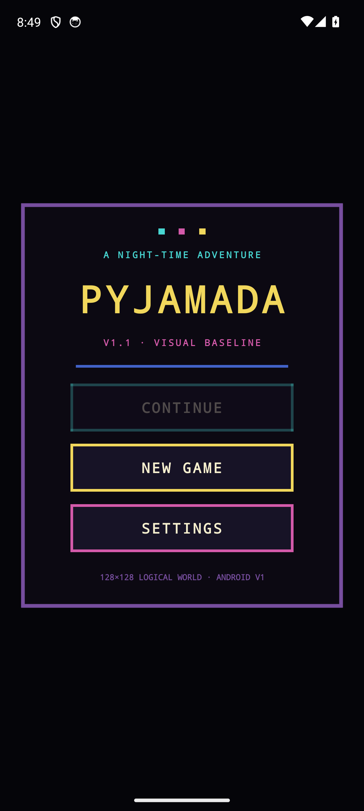
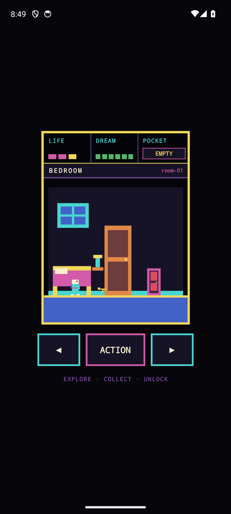
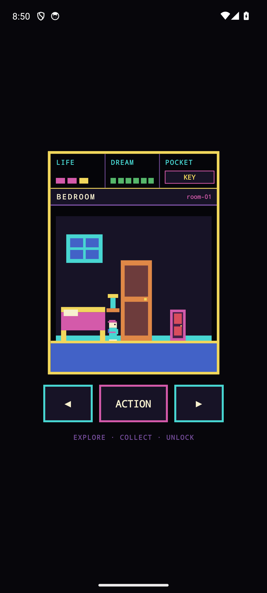
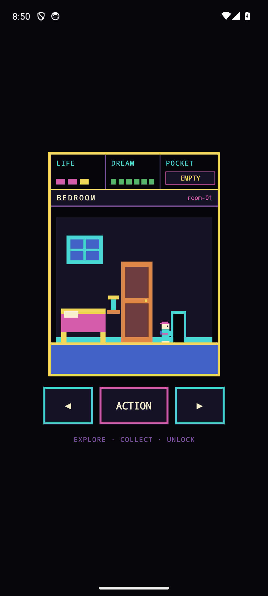
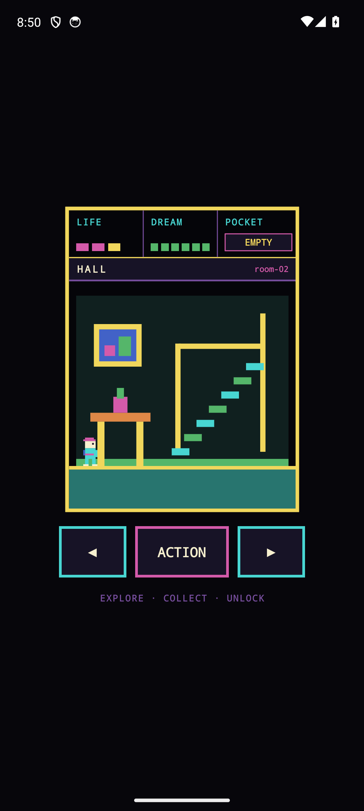
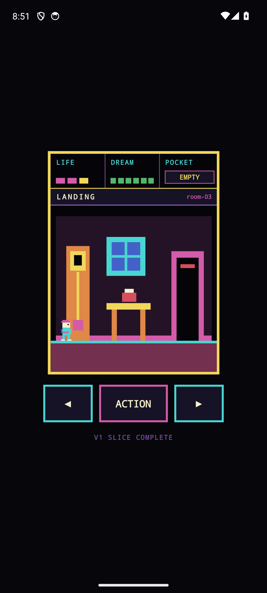

# Pyjamada

An Android-first, room-based retro adventure built with React Native, Expo, TypeScript, and React Native Skia.

Pyjamada is a compact vertical slice inspired by the feel of classic home-computer adventures: explore a bedroom, find a key, open the way forward, and reach the landing. The implementation and pixel art are original project work; no copyrighted Pyjamarama assets are distributed.

[](https://github.com/krukmat/Pyjamada/actions/workflows/android-emulator-smoke.yml)

## A short Android tour

These images come from a release APK running on an Android emulator. They are captured automatically with Maestro, so the gallery also exercises the real path through the current game slice.

<table>
  <tr>
    <td align="center"></td>
    <td align="center"></td>
    <td align="center"></td>
  </tr>
  <tr>
    <td align="center"><strong>Main menu</strong></td>
    <td align="center"><strong>Explore</strong></td>
    <td align="center"><strong>Find the key</strong></td>
  </tr>
</table>

<table>
  <tr>
    <td align="center"></td>
    <td align="center"></td>
    <td align="center"></td>
  </tr>
  <tr>
    <td align="center"><strong>Open the door</strong></td>
    <td align="center"><strong>Cross the hall</strong></td>
    <td align="center"><strong>Reach the landing</strong></td>
  </tr>
</table>

The complete capture set also includes the [settings screen](artifacts/android-screenshots/02_settings.png). The current baseline is **V1.1 / v0.6.0**: the V1 gameplay and persistence model with a focused visual-fidelity pass.

## Clone it and play

The repository is intentionally small enough to explore in one sitting. The game core is framework-independent, the rooms are rendered from project-owned pixel primitives, and the playable slice has no backend or account setup.

You need Node.js 22.13 or newer. To start the Expo development server:

```bash
git clone https://github.com/krukmat/Pyjamada.git
cd Pyjamada
npm install
npm run start
```

With an Android emulator already running, build and launch the native app with:

```bash
npm run android
```

## What is playable

- Start a new game or continue the local single-slot save.
- Explore the Bedroom, Hall, and Landing with touch controls.
- Collect the bedroom key and use it to unlock the progression door.
- Configure audio values and choose a standard or mirrored control layout.
- Persist validated, versioned game and settings data through AsyncStorage adapters.

The audio settings are persisted, but source-faithful audio playback remains deferred.

## Visual direction

The visual language is deliberately constrained: near-black negative space, saturated ZX-era colours, recognisable furniture silhouettes, a compact two-pose pajama hero, and a 128×128 logical Skia scene scaled cleanly for the device. Touch controls are styled as part of the game rather than generic mobile UI.

```text
BEDROOM                         HALL                    LANDING
bed + window + cabinet + key → picture + staircase → clock + continuation arch
```

See [Visual Baseline V1.1](docs/VISUAL_BASELINE_V1_1.md) for the rendering rules and [V1 Review](docs/V1_REVIEW.md) for the integrated product and architecture review.

## Architecture

```text
React Native shell
  ├── menu, settings, gameplay UI
  └── use cases: new game, continue, configure, play

Framework-independent TypeScript core
  ├── state, movement, rooms, collision, inventory, progression
  └── versioned game-save and settings codecs

Skia visual layer
  ├── original pixel primitives, room compositions, hero, HUD
  └── presentation derived from game state

Persistence
  ├── GameSavePort     → AsyncStorageGameSaveRepository
  └── GameSettingsPort → AsyncStorageGameSettingsRepository
```

Game rules stay outside React components, renderers do not own gameplay decisions, and use cases depend on ports rather than AsyncStorage directly.

## Stack

- Expo SDK 57 and React Native 0.86
- React 19.2.3 and strict TypeScript
- React Native Skia 2.6.2
- AsyncStorage 2.2.0 behind explicit persistence ports
- React Native Reanimated and Worklets for the Expo native stack

## Tests

Run the complete TypeScript, domain, integration, and visual suite:

```bash
npm run typecheck
npm run test:v1
```

Focused scripts are also available for `test:cu01`, `test:cu02`, `test:cu03`, `test:cu06`, `test:integration`, and `test:visual`.

The use-case specifications live in [`docs/`](docs/), including [CU-01](docs/CU-01.md), [CU-02](docs/CU-02.md), [CU-03](docs/CU-03.md), and [CU-06](docs/CU-06.md).

## Reproduce the Android screenshots

Install Java 17, the Android SDK and emulator, and [Maestro](https://maestro.mobile.dev/). Boot one emulator, then run:

```bash
npm run screenshots:android
```

The command builds and installs a release APK, plays the complete Maestro tour, and writes the PNG files to `artifacts/android-screenshots/`. See the [capture guide](maestro/README.md) for requirements and the faster flow-only option.

The CI [Android emulator smoke workflow](.github/workflows/android-emulator-smoke.yml) separately verifies native prebuild, release compilation, APK installation, launch, foreground activity, and emulator evidence on Android API 35.

## Scope

Pyjamada deliberately stops at the three-room vertical slice. A broader classic-mode port, final art and audio decisions, monetisation, accounts, cloud saves, and iOS distribution are outside the current baseline.
