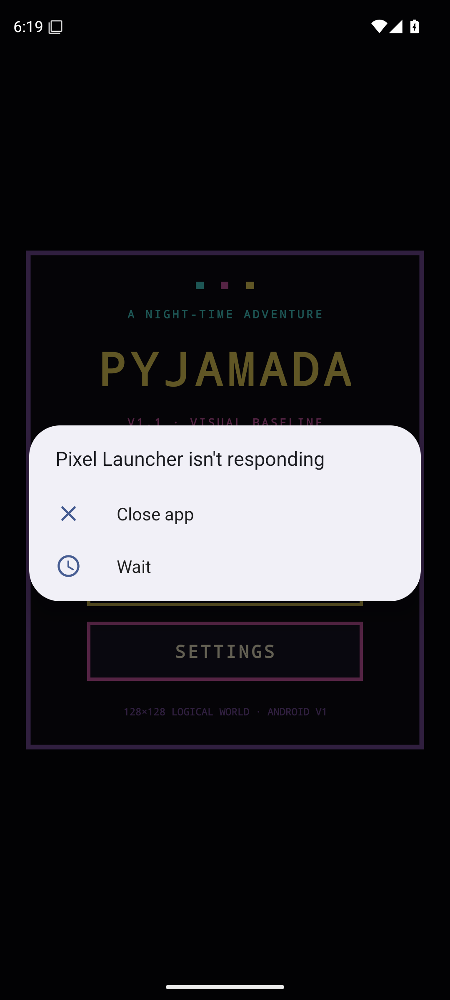

# Pyjamada

Android-first React Native/TypeScript project exploring a faithful room-based adventure architecture and a deliberately constrained retro visual language without distributing copyrighted Pyjamarama source assets.


## Current baseline — V1.1 / v0.6.0

The functional V1 remains unchanged:

- **CU-01 — Start New Game**
- **CU-02 — Continue Saved Game**
- **CU-03 — Minimal Vertical Slice Gameplay**
- **CU-06 — Configure Game**
- **CU-05 — Persist Game Progress** as an internal supporting capability

V1.1 is a **visual fidelity pass**, not a new gameplay phase. It replaces the original debug-style rectangles with an intentional retro presentation while keeping the TypeScript game core, persistence and use-case semantics intact.

See [`docs/VISUAL_BASELINE_V1_1.md`](docs/VISUAL_BASELINE_V1_1.md) for the visual rules and [`docs/V1_REVIEW.md`](docs/V1_REVIEW.md) for the integrated V1 architecture review.

## Android runtime validation

The V1.1 shell has now been built as a self-contained Android release APK and executed successfully in CI on a **Pixel 6 emulator / Android API 35**.

Validated gate:

- Expo Android prebuild ✅
- native React Native + Skia release build ✅
- APK installation ✅
- application launch ✅
- Pyjamada foreground activity verification ✅
- real emulator screenshot capture ✅
- V1 domain/integration tests + TypeScript typecheck ✅

The reproducible smoke workflow is [`android-emulator-smoke.yml`](.github/workflows/android-emulator-smoke.yml). Each successful run publishes `pyjamada-android-emulator-smoke` containing the tested APK, screenshot, logcat and window/focus evidence. Workflow artifacts are temporary CI evidence rather than a release distribution channel.

[Open Android emulator smoke runs](https://github.com/krukmat/Pyjamada/actions/workflows/android-emulator-smoke.yml)

## Real Android screenshot

This is a **real capture from the validated Android emulator run**, not a concept mockup:

<p align="center">
  
</p>

## V1.1 visual direction

The target is deliberately limited rather than visually provisional:

- black / near-black negative space;
- saturated cyan, magenta, yellow, green, red and blue blocks;
- room compositions built around recognisable furniture silhouettes;
- an original compact pajama-character sprite with a two-pose walk treatment;
- a recognisable key and closed/open door state;
- a retro HUD integrated with the game frame;
- touch controls styled as secondary game hardware rather than generic mobile UI;
- all art authored from project-owned geometric/pixel primitives rather than copied sprites.

### Three-room slice

```text
BEDROOM
  bed + window + cabinet + key + progression door
        ↓
HALL
  picture + console + vase + staircase
        ↓
LANDING
  tall clock + window + table + continuation arch
```

Gameplay progression is still:

```text
room-01
  ↓
collect bedroom-key
  ↓
locked door collision
  ↓
ACTION consumes key
  ↓
bedroomDoorUnlocked
  ↓
room-02
  ↓
room-03
  ↓
verticalSliceReached
```

## Architecture

```text
React Native Shell
   ├── CU-01 New Game
   ├── CU-02 Continue
   ├── CU-06 Settings
   └── CU-03 Gameplay UI

TypeScript Game Core
   ├── GameState
   ├── updateGame()
   ├── rooms / collision / inventory / progression
   └── GameStateCodec

Visual Layer
   ├── VisualLanguage (pure visual model)
   ├── PixelArtKit (original reusable pixel primitives)
   ├── RoomScene (3 composed rooms)
   ├── PajamaHero (position-derived two-pose sprite)
   └── RetroHud

React Native Skia
   └── 128×128 logical renderer, integer-scaled by the shell

Persistence
   ├── GameSavePort → AsyncStorageGameSaveRepository
   └── GameSettingsPort → AsyncStorageGameSettingsRepository
```

Architectural rules:

- Game rules/state remain outside React UI components.
- Visual animation pose is derived from existing player position; no presentation-only gameplay state was added.
- Skia renders game state; it does not own gameplay decisions.
- Game save and application settings remain separate domains and storage keys.
- Use cases depend on ports, not directly on AsyncStorage.
- Save/settings schemas remain versioned and validated.
- No original/remake sprites, maps, audio or other copyrighted Pyjamarama assets are included.

## CU-06 settings

Settings remain independent from the game save:

- audio ON/OFF;
- music volume;
- SFX volume;
- standard/mirrored touch-control layout.

The touch layout affects CU-03 controls immediately. Audio values are persisted but source-faithful audio playback remains deferred.

## Stack

- Expo SDK 57
- React Native 0.86
- React 19.2.3
- TypeScript
- React Native Skia 2.6.2
- AsyncStorage 2.2.0 behind explicit persistence ports
- React Native Reanimated / Worklets runtime required by the Expo 57 native stack
- Node.js 22.13+ required by Expo SDK 57

## Run

```bash
npm install
npx expo start
```

For Android native development:

```bash
npx expo run:android
```

## Tests

```bash
npm run test:cu01
npm run test:cu02
npm run test:cu03
npm run test:cu06
npm run test:integration
npm run test:visual
npm run test:v1
```

Specifications:

- [`docs/CU-01.md`](docs/CU-01.md)
- [`docs/CU-02.md`](docs/CU-02.md)
- [`docs/CU-03.md`](docs/CU-03.md)
- [`docs/CU-06.md`](docs/CU-06.md)
- [`docs/VISUAL_BASELINE_V1_1.md`](docs/VISUAL_BASELINE_V1_1.md)
- [`docs/ANDROID_SMOKE_TEST.md`](docs/ANDROID_SMOKE_TEST.md)

## Deferred

- broader/full Classic Mode port;
- final/source-authentic art and audio decisions;
- advanced settings/accessibility;
- monetization, Google Play Billing and entitlements;
- Premium Extras / Challenge Packs;
- backend/accounts/cloud saves;
- iOS/App Store/StoreKit.

## Next gate

The native startup gate is now proven. The next validation should exercise the **CU-03 slice interactively on Android**, inspect Bedroom → Hall → Landing, verify persistence/lifecycle behavior on the emulator and add gameplay screenshots only from validated runtime states. No broader gameplay scope should be added before that pass.
