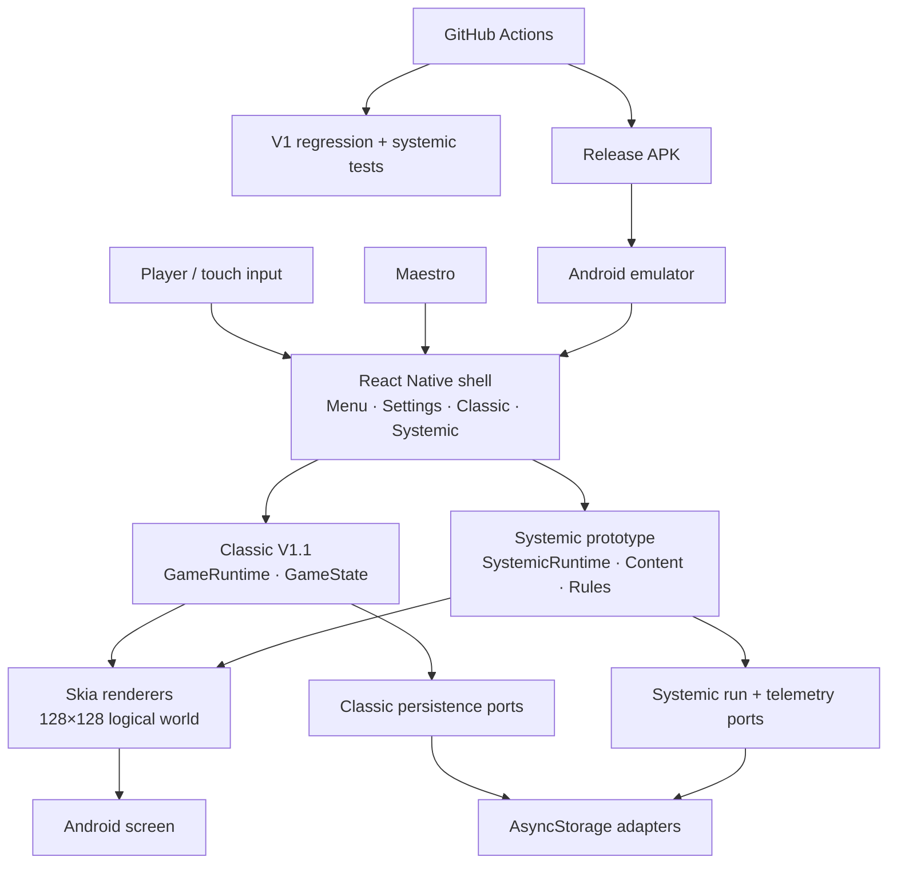

# Pyjamada

**A tiny retro adventure built as a React Native game architecture playground.**

Pyjamada explores a simple idea:

> **React Native owns the app shell. TypeScript owns the game. Skia owns the pixels.**

It is a real Android vertical slice you can clone, build, play, test, and automate — now with a second, isolated gameplay experiment that asks how much replayability can come from very few controls and a small set of reusable rules.

### Why clone it?

- Framework-independent TypeScript game core.
- React Native without using React as the game loop.
- React Native Skia rendering a 128×128 logical world.
- Versioned save/settings persistence behind ports and adapters.
- Deterministic room, collision, inventory, progression, and systemic-rule logic.
- Release APK validation on an Android emulator.
- Maestro-driven gameplay and reproducible screenshots.
- Small enough to understand and modify quickly.

**The game is the demo; the architecture is the experiment.**

[](https://github.com/krukmat/Pyjamada/actions/workflows/android-emulator-smoke.yml)

## Two playable experiments

### Classic V1.1

The original deterministic vertical slice remains intact:

**Bedroom → key → door → Hall → Landing**

It proves movement, collision, inventory, room transitions, persistence and the React Native / TypeScript / Skia boundaries.

### Systemic Bedroom Prototype

The experimental mode keeps only **left / right / action**, but gives the Bedroom reusable consequences:

- 6 interactable objects;
- logical Time, Energy and Noise;
- 4 Wally states: sleepy, normal, rushed and startled;
- 10 deterministic rules;
- a short objective: **get dressed + find the keys**;
- success, near-miss and chaos paths;
- deterministic **Try Again** restart;
- isolated persistence and local telemetry boundaries.

The design goal is simple: **Wally tries to complete an ordinary domestic task; small actions combine into increasingly absurd but understandable consequences.**

This mode is a gameplay hypothesis, not a claim that fun or retention has already been proven. Expansion remains gated by human playtesting.

## Android tour

These screenshots come from the actual release APK. Maestro drives the Classic V1.1 playable flow automatically:

<table>
  <tr>
    <td align="center"></td>
    <td align="center"></td>
    <td align="center"></td>
  </tr>
  <tr>
    <td align="center"><strong>Main menu</strong></td>
    <td align="center"><strong>Explore</strong></td>
    <td align="center"><strong>Find the key</strong></td>
  </tr>
</table>

<table>
  <tr>
    <td align="center"></td>
    <td align="center"></td>
    <td align="center"></td>
  </tr>
  <tr>
    <td align="center"><strong>Open the door</strong></td>
    <td align="center"><strong>Cross the hall</strong></td>
    <td align="center"><strong>Reach the landing</strong></td>
  </tr>
</table>

The full Classic capture set also includes the [settings screen](artifacts/android-screenshots/02_settings.png). The systemic flow is defined separately in [`maestro/systemic.yaml`](maestro/systemic.yaml).

## Clone and run

```bash
git clone https://github.com/krukmat/Pyjamada.git
cd Pyjamada
npm install
npm run android
```

Node.js 22.13+ is required.

## Architecture

At a glance, the implementation keeps Classic gameplay and the systemic experiment behind the same architectural boundaries:



The important boundary is the middle: **React handles the shell, TypeScript owns gameplay decisions, and Skia only renders state.** The systemic rules remain deterministic and framework-independent; Classic saves and systemic prototype saves are isolated from one another.

## Experiment with it

Change object definitions, author a new reusable rule, rebalance resources, swap the renderer, replace persistence, or redesign reactions without rewriting the app shell.

The systemic prototype deliberately avoids a fixed-step real-time loop: logical time advances through player decisions, keeping runs reproducible and easy to test.

## Validate it

```bash
npm run typecheck
npm run test:v1
npm run test:systemic
```

Or run both suites:

```bash
npm run test:all
```

For Android flows:

```bash
npm run screenshots:android
maestro test maestro/systemic.yaml
```

The CI [Android emulator smoke workflow](.github/workflows/android-emulator-smoke.yml) separately validates native generation, release build, installation and startup.

For deeper notes, see [Systemic Gameplay Plan](docs/SYSTEMIC_GAMEPLAY_PLAN.md), [Systemic Prototype Implementation](docs/SYSTEMIC_GAMEPLAY_IMPLEMENTATION.md), [Visual Baseline V1.1](docs/VISUAL_BASELINE_V1_1.md), [V1 Review](docs/V1_REVIEW.md), and the [Maestro capture guide](maestro/README.md).

## Scope

Current development baseline: **V1.1 + Systemic Room Prototype / v0.7.0**.

Classic V1.1 remains the stable three-room architecture baseline. The systemic Bedroom is an intentionally bounded gameplay experiment. A second room, final audio/art, monetization, cloud features, live operations and iOS remain out of scope until the systemic prototype passes its documented human fun gate.
