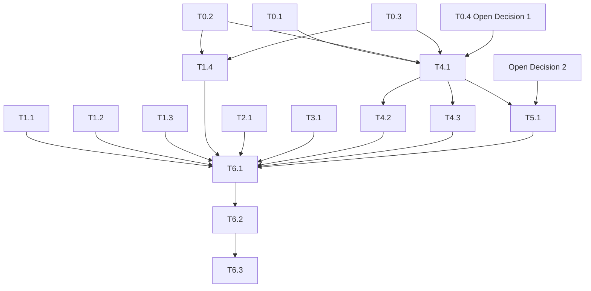

# UI/UX Improvement Plan

## Purpose

This documents the implementation plan for the UI/UX pass explored in the design canvas
(`Pyjamada Bedroom HUD`, published as a Claude Artifact during design review). It does not
change CU-01/02/03/05/06 semantics — this is presentation only, same as V1.1.

Six directions were mocked up: HUD + touch-control clarity, Main Menu hierarchy, Settings
grouping, a restrained room-art polish pass, an aggressive stylized room-art redesign, and
object/scene/player detail additions. This plan turns those mockups into code.

## Adjustments required before implementation

The mockups were built in HTML/CSS. The real renderer is not CSS — `GameCanvas.tsx` draws
through `@shopify/react-native-skia`, and today `PixelArtKit.tsx` / `RoomScene.tsx` only use
one primitive: a flat-color `Rect` (the `PixelBlock` type — `x, y, width, height, color`).
None of the following exist yet in the render layer, and every visual task below needs at
least one of them:

| Mockup technique | Real equivalent needed |
|---|---|
| `border-radius` | Skia `RoundedRect` (no rounded-rect primitive exists in `PixelArtKit.tsx` today) |
| `linear-gradient` / `radial-gradient` | Skia `LinearGradient`/`RadialGradient` shaders |
| `filter: brightness()` for shading | Cannot be done live in Skia — needs explicit dark/light color **tokens** added to `RETRO_PALETTE` in `VisualLanguage.ts`, computed once, not derived at render time |
| `box-shadow` glow (key pulse, halos) | Skia blur/mask filter, or layered soft-edged shapes |
| `clip-path` polygon (blanket fold) | Skia `Path` |
| CSS `@keyframes` (pulse, toast entrance, pressed state) | An animation mechanism compatible with Skia — needs a decision (see below) |

**Conflict with the existing visual baseline.** `docs/VISUAL_BASELINE_V1_1.md` rule 3 says
*"Limited saturated palette... used in strong blocks with very little shading"* and rule 4
says geometry is *"scaled without smoothing."* The restrained room-art mockup respects both.
The aggressive stylized mockup (rounded silhouettes, gradients, glows, dithering) deliberately
breaks both. Shipping the stylized direction means consciously superseding V1.1's own rules,
not just adding code — see Open Decision 1.

**Confirmed safe, low-risk:**
- `tests/visual-baseline.test.ts` only checks *shape* (palette keys are strings, walk frame
  changes with position, pocket label derives from inventory) — it does not assert exact
  colors or coordinates, so restyling won't break it as long as `ROOM_VISUALS`, `getWalkFrame`,
  and `getPocketLabel` keep their current contracts.
- Gameplay hitboxes (`LEFT_BOUND`, `RIGHT_BOUND`, `LOCKED_DOOR_X`, door/key pickup zones) live
  in `GameRuntime.ts`/`World.ts` and are independent of `RoomScene.tsx`'s pixel art. Redesigning
  furniture is safe as long as the door's origin (`x:92, y:80`) and the key's origin
  (`x:48, y:96`) stay exactly where `BedroomScene` places them today — decorative sub-shapes
  can be added freely around those anchors.

## Open decisions

1. **Which room-art direction ships — RESOLVED: restrained.** Reasoning below. This closes
   T0.4 without needing a new baseline doc.
2. **Room-02 / room-03**: only room-01 (bedroom) was mocked up. Shipping room-01 alone with a
   new look while the hall and landing stay flat-block risks an inconsistent slice. Still open
   — decide whether W5 (extending the chosen direction to the other two rooms) ships in the
   same release or is explicitly deferred. The restrained direction being cheap and systematic
   (see below) makes bundling it in the same release more realistic than the stylized one
   would have been.

### Why restrained, not stylized

Chosen on quality + playability grounds, not taste:

- **Readability at a glance is a stated V1.1 rule** ("large furniture silhouettes carry more
  value than decorative noise") and it's also just good mobile design: the room renders at
  ~300–384px on a phone screen. Diamond inlays, dust motes, wood grain and tiny brass glints
  read fine in a zoomed static mockup and turn to mud at real in-game scale.
- **Render cost**: the stylized pass roughly doubled-to-tripled the shape count per object
  (cabinet 4→9+ blocks, bed 5→15+, door 5→13+) and leans on gradients/blur, none of which
  exist in the Skia layer today. That's a much bigger, riskier engineering investment for a
  mobile target than adding a handful of shade tokens and one glow primitive.
- **Identity coherence**: V1.1 explicitly targets "a deliberately constrained retro
  presentation... not a modern mobile reinterpretation." Arched windows, ornate cornices and
  curtains read as a different, cozier genre — and would leave the HUD/menus (staying
  flat-block) visually mismatched against the room art unless *everything* got restyled too,
  which is a much larger undertaking than what was asked.
- **Systematic > bespoke**: "outline + one shade tone + a contact shadow" is a rule that
  generalizes trivially to room-02/03 and to future rooms. The stylized furniture (cornice,
  plinth, diamond inlay, curtains) was hand-fitted per object and doesn't generalize as
  cheaply — bigger authoring cost for the two rooms not yet designed.

**Three elements are worth cherry-picking from the stylized pass anyway**, since each is a
single cheap shape with a real clarity payoff and no coherence cost:
- the key's ring-shaped bow + two-length teeth (reads as "a key" far better than 4 flat
  rectangles — it's the one item players must recognize as collectible);
- the hero's contact shadow (one soft ellipse; grounds the character, cheap, doesn't compete
  with anything);
- a faint window moonbeam + 2–3 stars (a background wash behind the furniture, not fighting it
  for attention).

Everything else from the stylized mockup (arches, curtains, wood grain, dithered floor,
diamond inlays, vignette, brass highlights) is dropped.

## Workstreams and tasks

### W0 — Foundations (blocking)

| ID | Task | Files | Depends on |
|---|---|---|---|
| T0.1 | Add explicit dark/light shade tokens to `RETRO_PALETTE` (e.g. `cyanDark`, `orangeDark`) — replaces every `filter: brightness()` used in the mockups; covers the restrained pass's 2-tone shading | `src/game/render/VisualLanguage.ts` | — |
| T0.2 | Extend `PixelArtKit.tsx` with **one** new primitive: a soft-glow/halo (for the key's pulse and the contact shadow). Rounded-rect and gradient primitives are *not* needed — dropped with the stylized direction | `src/game/render/PixelArtKit.tsx` | Spike: confirm `@shopify/react-native-skia` 2.6.2 API for blur/mask |
| T0.3 | Pick one animation mechanism for the key's pulse (Skia clock-driven value vs. the Reanimated runtime pulled in by the recent "Expo 57 animation runtime dependencies" commit) | `src/game/render/PixelArtKit.tsx` | T0.2 |
| T0.4 | ~~Open Decision 1~~ — **resolved: restrained direction.** No baseline doc rewrite needed; `docs/VISUAL_BASELINE_V1_1.md` stays authoritative as-is | — | — |

### W1 — HUD & touch controls (no Skia primitives needed beyond flat blocks; mostly RN StyleSheet)

| ID | Task | Files | Depends on |
|---|---|---|---|
| T1.1 | Uniform 3-icon LIFE row, numeric DREAM readout, key glyph in POCKET | `src/app/RetroHud.tsx` | — |
| T1.2 | Resize touch controls, add pixel-shadow raised style + pressed state | `src/app/GameScreen.tsx` | — |
| T1.3 | Room-strip progress dots, derived from `ROOM_IDS.indexOf(gameState.roomId)` (no new state) | `src/app/GameScreen.tsx` | — |
| T1.4 | "+ KEY COLLECTED" pickup toast, triggered by a transient (non-persisted) local flag when `flags.bedroomKeyCollected` flips true | `src/app/GameScreen.tsx` or `App.tsx` | T0.3 (entrance animation) |

### W2 — Main Menu

| ID | Task | Files | Depends on |
|---|---|---|---|
| T2.1 | Primary/secondary/lab-tier hierarchy, pixel-shadow buttons, pressed state, "no saved game" hint on disabled CONTINUE | `src/app/MainMenu.tsx` | — |

### W3 — Settings

| ID | Task | Files | Depends on |
|---|---|---|---|
| T3.1 | Grouped AUDIO/CONTROLS sections, pixel volume-meter bars for MUSIC/SFX | `src/app/SettingsScreen.tsx` | Soft: reuse the meter component from T1.1 if factored out shared |

### W4 — Room art, room-01 (the substantial one)

| ID | Task | Files | Depends on |
|---|---|---|---|
| T4.1 | Implement the restrained direction for the bedroom: outline + one shade tone per object, dithered-look floor kept simple (a handful of alternating blocks, not a shader), contact shadow under the hero, key redrawn as a ring+teeth silhouette with its pulse, faint window moonbeam + 2–3 stars. Preserve the door's `(92,80)` and key's `(48,96)` origins and the `ROOM_VISUALS['room-01']` contract exactly | `src/game/render/RoomScene.tsx`, `src/game/render/PixelArtKit.tsx` | T0.1, T0.2, T0.3 |
| T4.2 | Add a short "V1.1 restrained polish" addendum note to `docs/VISUAL_BASELINE_V1_1.md` describing the outline/shade/glow/shadow additions (no rule changes, since none of V1.1's existing rules were broken) | `docs/VISUAL_BASELINE_V1_1.md` | T4.1 |
| T4.3 | Visual smoke check: `npm run test:visual` must still pass unchanged; manual Android emulator screenshot pass per `docs/ANDROID_SMOKE_TEST.md` (Skia's real output can differ from the CSS mockup, especially gradients/blur) | — | T4.1 |

### W5 — Room art, room-02 / room-03 (contingent on Open Decision 2)

| ID | Task | Files | Depends on |
|---|---|---|---|
| T5.1 | Extend the shipped room-01 treatment to `HallScene` and `LandingScene` for a consistent slice | `src/game/render/RoomScene.tsx` | T4.1, Open Decision 2 |

### W6 — QA / release

| ID | Task | Depends on |
|---|---|---|
| T6.1 | `npm run test:v1` + `npm run typecheck` clean | All of W1–W5 in scope for the release |
| T6.2 | Bump the baseline/version line in `CLAUDE.md` if this ships as a new baseline | T6.1 |
| T6.3 | Android emulator smoke test per `docs/ANDROID_SMOKE_TEST.md` before merge (CI already gates on this) | T6.2 |

## Dependency graph

## Suggested sequencing

1. **Phase 0 — Foundations**: T0.1–T0.4. Nothing in W4 can start before this closes, and Open
   Decision 1 needs your answer here.
2. **Phase 1 — Low-risk, parallel, ship independently**: T1.1, T1.2, T1.3, T2.1, T3.1. None of
   these depend on W0 and none depend on each other — good early wins while Phase 0 is decided.
3. **Phase 2**: T1.4 (needs T0.3).
4. **Phase 3 — Room art**: T4.1 → T4.2 → T4.3.
5. **Phase 4 — Optional**: T5.1, only if Open Decision 2 says extend to room-02/03 now.
6. **Phase 5 — Release**: T6.1 → T6.2 → T6.3.
